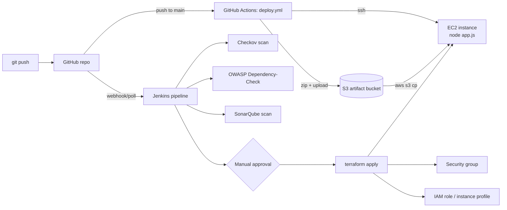

# AWS CI/CD Pipeline Demo

A small Express app deployed to a single EC2 instance, with the infrastructure and application deploy
handled by two separate pipelines: Terraform applied through Jenkins, and the app itself shipped by a
GitHub Actions workflow.

## What's actually here

- `app.js` / `package.json` - a one-route Express app that returns a static string. It exists to give the
  pipelines something to deploy, not to demonstrate application design.
- `main.tf`, `vars.tf`, `backend.tf` - Terraform for one EC2 instance, an S3 bucket for build artifacts,
  a security group, and an IAM role/instance profile that gives the instance read-only S3 access.
- `Jenkinsfile` - runs Checkov and OWASP Dependency-Check against the Terraform, selects a workspace
  (`development` off `main`, `production` on `main` - see Known gaps), runs a SonarQube scan, and applies
  the plan after a manual approval gate.
- `.github/workflows/deploy.yml` - zips the app, uploads it to S3, and SSHes into the EC2 host to pull
  the zip down and restart the process.

## Architecture



There are two pipelines because they own two different things: Jenkins owns infrastructure changes
(Terraform, with a scan-then-approve gate before anything touches the account), and GitHub Actions owns
application deploys (build, zip, push to the box that Terraform already created). I kept them separate
rather than folding app deploy into the Jenkins pipeline because the two change at different rates and
have different blast radii - I didn't want an app deploy to require the same manual Terraform approval
step, and I didn't want infra changes triggered by an app-only push.

The deploy mechanism itself is intentionally the cheap option for a single-instance demo: SSH in, unzip,
`npm start &`. It is not how I'd deploy anything with more than one instance or that needed zero-downtime
restarts - there's no process supervisor, no health check, and no rollback other than re-running the
workflow with a previous commit checked out.

## Known gaps

- Single EC2 instance, no load balancer, no auto scaling. Restarting the app briefly drops all traffic.
- `npm start &` with no process manager (no PM2/systemd unit). If the process crashes, nothing restarts it.
- The Jenkinsfile assumes Jenkins credentials (`aws-dev-user`, `aws-prod-user`, `snyk-token-soodrajesh`,
  a `SonarQube` string credential, and a Slack integration) that have to be configured by hand on the
  Jenkins controller; none of that is codified here.
- Branch-based workspace selection (`main` -> production, everything else -> development) means anyone
  who can push to `main` can trigger a production apply after a single manual approval click - there's
  no separate production approver or environment protection.
- The GitHub Actions workflow and the Jenkins pipeline don't coordinate. It's possible for GitHub Actions
  to deploy new app code to an instance that Jenkins is about to replace, or vice versa.
- The security group opens SSH (22) to `0.0.0.0/0`, which is called out in the Terraform comment as a
  "restrict this in production" item that was never followed up on.
- `terraform.tfvars` isn't checked in (correctly, since `ami_id`/`ec2_key_pair` are environment-specific),
  which means `terraform apply` will fail on a fresh checkout until someone supplies those values.

## Project structure

```
.
├── Jenkinsfile               # infra pipeline: scan, plan, approve, apply
├── .github/workflows/deploy.yml  # app pipeline: build, zip, ship to EC2
├── main.tf                   # EC2 instance, S3 bucket, security group, IAM role
├── vars.tf                   # region, project name, AMI id, key pair name
├── backend.tf                # S3 backend + DynamoDB lock table for state
├── skip_checks.txt           # Checkov check IDs excluded from the Jenkins scan
├── app.js                    # single-route Express app
└── package.json
```

## Running it

Infrastructure:

```
terraform init
terraform apply \
  -var="ami_id=<amazon-linux-2-ami-for-your-region>" \
  -var="ec2_key_pair=<your-key-pair-name>"
```

Note the EC2 public IP and the S3 bucket name from the output - both are needed for the GitHub Actions
secrets below.

App locally (no AWS needed):

```
npm install
npm start
# http://localhost:3000
```

GitHub Actions deploy: add these repository secrets, then push to `main`.

- `AWS_ACCESS_KEY_ID`, `AWS_SECRET_ACCESS_KEY`, `AWS_REGION`
- `S3_BUCKET` - the bucket Terraform created
- `EC2_HOST` - the instance's public IP or DNS
- `EC2_SSH_KEY` - private key contents for the EC2 key pair

Jenkins pipeline: requires the credentials listed under Known gaps to be present on the controller
(`aws-dev-user`, `aws-prod-user`, `SonarQube`, `snyk-token-soodrajesh`) plus a Slack integration for the
`slackSend` steps, none of which this repo sets up for you.
