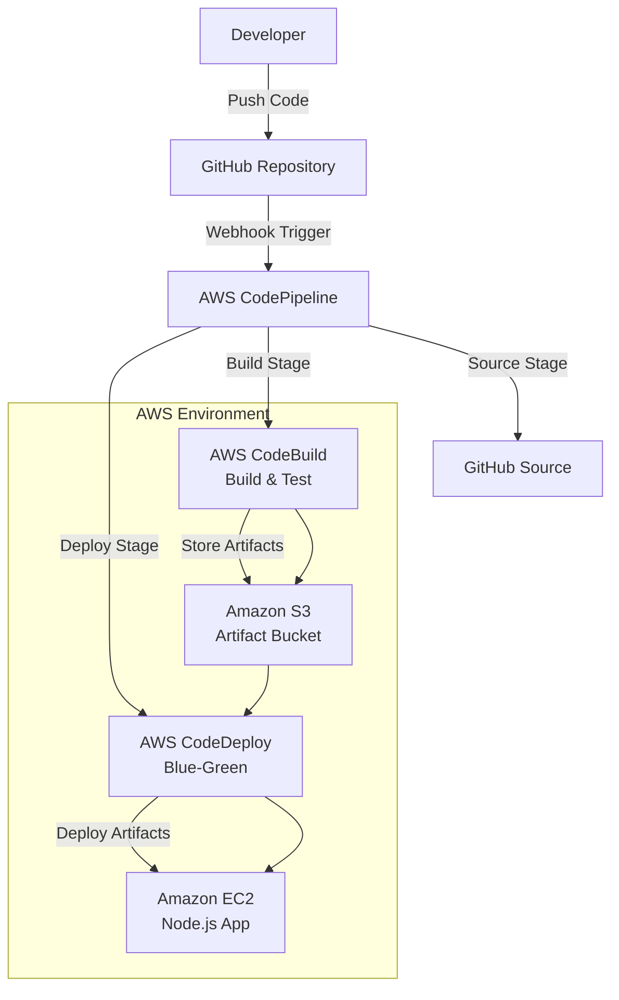

# AWS-CICD-Pipeline-Demo


A production-ready demonstration of a CI/CD pipeline using AWS services (CodePipeline, CodeBuild, CodeDeploy) and GitHub Actions to automate the build, test, and deployment of a Node.js web application to Amazon EC2.

## 🚀 Overview

This repository showcases a complete CI/CD pipeline using AWS services to automate the software delivery process. A sample Node.js Express application is built, tested, and deployed to an EC2 instance, with artifacts stored in Amazon S3. The pipeline integrates with GitHub for source control and uses AWS CodePipeline for orchestration, CodeBuild for building/testing, and CodeDeploy for blue-green deployments. The setup emphasizes DevOps best practices, security, and scalability.

### Key Features
- **Automated CI/CD Pipeline**: Triggered by GitHub commits, with stages for source, build, test, and deploy.
- **AWS CodePipeline**: Orchestrates the pipeline, integrating with GitHub, CodeBuild, and CodeDeploy.
- **AWS CodeBuild**: Builds the Node.js app and runs unit tests, producing artifacts stored in S3.
- **AWS CodeDeploy**: Deploys artifacts to EC2 with blue-green deployment for zero downtime.
- **Sample Application**: A simple Node.js Express app serving a "Hello, World!" endpoint.
- **Infrastructure as Code**: Terraform provisions EC2, S3, and IAM roles for the pipeline.
- **Security Practices**: IAM roles with least privilege and encrypted S3 buckets.

## 🏗️ Architecture



## 📋 Prerequisites

Before setting up the pipeline, ensure you have:
- **AWS Account** with permissions for CodePipeline, CodeBuild, CodeDeploy, EC2, S3, IAM, and CloudFormation/Terraform.
- **GitHub Account** with a repository and access token for AWS integration.
- **AWS CLI** configured with credentials.
- **Terraform** (v1.5 or later) installed for infrastructure provisioning.
- **Node.js** (v18.x) and npm for local testing.
- **EC2 Key Pair** for SSH access.
- **GitHub Personal Access Token** with `repo` scope for CodePipeline integration.

## 🚀 Quick Start

### 1. Clone the Repository
```bash
git clone https://github.com/soodrajesh/AWS-CICD-Pipeline-Demo.git
cd AWS-CICD-Pipeline-Demo
```

### 2. Set Up AWS Infrastructure
1. **Provision Infrastructure with Terraform**:
   ```bash
   cd terraform
   terraform init
   terraform apply -var-file="terraform.tfvars"
   ```
   Update `terraform.tfvars` with:
   - `aws_region`: e.g., `us-east-1`
   - `key_name`: Your EC2 key pair name
   - `github_token`: GitHub personal access token
2. **Outputs**:
   - Note the S3 bucket name, CodePipeline ARN, and EC2 public IP from `terraform output`.

### 3. Configure GitHub
1. **Add Webhook**:
   - In your GitHub repository, go to `Settings` > `Webhooks` > `Add Webhook`.
   - Set `Payload URL` to the CodePipeline webhook URL (from AWS console or Terraform output).
   - Select `Push` events.
2. **Store GitHub Token**:
   - Add the GitHub token to AWS Secrets Manager or as a secure parameter in CodePipeline.

### 4. Run the Pipeline
1. **Push Code to Trigger Pipeline**:
   ```bash
   git add .
   git commit -m "Initial commit"
   git push origin main
   ```
2. **Monitor Pipeline**:
   - Open the AWS CodePipeline console and view the pipeline status.
   - Check CodeBuild logs for build/test details and CodeDeploy for deployment status.

### 5. Access the Application
- **EC2 URL**: Run `terraform output ec2_public_ip` and access `http://<ec2-public-ip>:3000`.
- **Test Endpoint**: `curl http://<ec2-public-ip>:3000` should return "Hello, World!".

## 📁 Project Structure
```
AWS-CICD-Pipeline-Demo/
├── src/                  # Sample Node.js application
│   ├── app.js            # Express app
│   ├── package.json      # Node.js dependencies
│   └── tests/            # Unit tests
├── terraform/            # Terraform configs for AWS infrastructure
│   ├── main.tf           # Infrastructure configuration
│   ├── variables.tf      # Input variables
│   ├── outputs.tf        # Output values
│   └── terraform.tfvars.example  # Example variable file
├── buildspec.yml         # CodeBuild build specification
├── appspec.yml           # CodeDeploy deployment specification
├── scripts/              # Deployment scripts for CodeDeploy
│   ├── start.sh          # Start the Node.js app
│   └── stop.sh           # Stop the app
├── README.md             # This file
└── .gitignore            # Git ignore rules
```

## 🔒 Security Best Practices
- **IAM Roles**: Use least-privilege roles for CodePipeline, CodeBuild, and CodeDeploy.
- **S3 Encryption**: Enable server-side encryption for the artifact bucket.
- **GitHub Token**: Store in AWS Secrets Manager or Parameter Store, not in plain text.
- **Security Groups**: Restrict EC2 inbound traffic to port 3000 (app) and 22 (SSH, limit to your IP).
- **CodeDeploy Agent**: Ensure installed on EC2 instances for deployment.

## 📊 Monitoring and Maintenance
- **CloudWatch**: Monitor CodePipeline, CodeBuild, and EC2 metrics (e.g., CPU, request latency).
- **CodeDeploy Logs**: Check `/var/log/aws/codedeploy-agent/` on EC2 for deployment issues.
- **Pipeline Status**: View in AWS CodePipeline console or set up SNS notifications.
- **Backups**: Enable S3 versioning for the artifact bucket.
- **Scaling**: Adjust EC2 instance type or count via Terraform for load handling.

## 🧹 Cleanup
To avoid costs:
```bash
cd terraform
terraform destroy -var-file="terraform.tfvars"
```
Manually delete CodePipeline, CodeBuild projects, and S3 buckets if not managed by Terraform.

## 🔍 Troubleshooting
- **Pipeline Failures**:
  - Check CodePipeline logs in the AWS console.
  - Verify `buildspec.yml` syntax and paths in CodeBuild.
- **CodeDeploy Issues**:
  - Ensure the CodeDeploy agent is running: `sudo systemctl status codedeploy-agent`.
  - Check `appspec.yml` for correct file paths.
- **EC2 Access Issues**:
  - Verify security group allows port 3000 and SSH.
  - Run `aws ec2 describe-instances --instance-ids <instance-id>` to check status.
- **GitHub Webhook**:
  - Ensure the webhook URL is correct and events are triggered.
- **Debug Commands**:
  ```bash
  aws codepipeline get-pipeline --name <pipeline-name>
  aws codebuild batch-get-builds --ids <build-id>
  aws codedeploy get-deployment --deployment-id <deployment-id>
  ```

## 🤝 Contributing
1. Fork the repository.
2. Create a feature branch: `git checkout -b feature/your-feature`.
3. Commit changes: `git commit -m 'Add your feature'`.
4. Push to the branch: `git push origin feature/your-feature`.
5. Submit a pull request.

## 📄 License
This project is licensed under the MIT License - see the [LICENSE](LICENSE) file for details.

## 🆘 Support
For issues:
- Check the [troubleshooting section](#troubleshooting).
- Review AWS documentation for [CodePipeline](https://docs.aws.amazon.com/codepipeline), [CodeBuild](https://docs.aws.amazon.com/codebuild), [CodeDeploy](https://docs.aws.amazon.com/codedeploy), and [Terraform](https://www.terraform.io/docs).
- Open a GitHub issue for bugs or questions.

⭐ If this project helps you, please give it a star!

## 🙏 Acknowledgments
- AWS for robust CI/CD services.
- GitHub for seamless source control integration.
- Built with ❤️ for the DevOps community.
